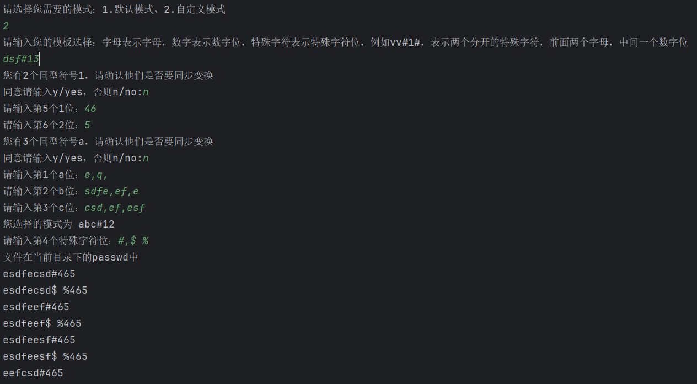

# 针对运营账号的密码生成器
大佬轻喷

首先用途是打算在红队hvv的时候作为一个运营账号的密码爆破，来自手写密码很烦的灵感。

当前是自带了默认模式，输入产品名称，选择是否使用默认带的特殊符号字典，选择年份。即可生成一份常规的运营密码字典

如果不想用常规的运营密码，想根据手上有的资料进行生成的话，可以使用自定义模式

### 默认模式

产品名(必填)，选用默认特殊符号(选填,默认真)，填写年份(选填，默认当前年份包当前前五年)

得出，产品名+特殊符号+年份  递归结果

### 自定义模式

输入模板，字母代表此处输入名称之类，特殊符号填写特殊符号，数字填写数字。自由安排顺序

输入一位代表多位占用符，你可以输入a，但是在后续输入阶段输入多个字母，默认多字母当成整体，如果在当前位置有多种可能的字符，则可以使用逗号进行分割。将以分割后的分别参与递归

可选择是否同步变换，如果同步变换则多个同类型占位符会使用同一份输入的字典，同时进行参与递归打印

结果会打印在同目录下passwd.txt中

#### 例如

此处并没有使用命令行参数的模式，后续添加